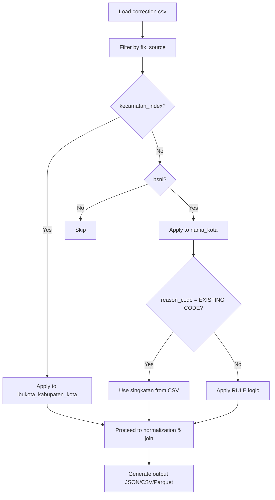

# Kecamatan Index Comparison and Corrections

## Introduction
This document tracks unmatched city names from kecamatan index processing against BSNI kode_wilayah data, documents applied corrections, and outlines the planned CorrectionLoader integration to automate fixes. The goal is to improve data accuracy by resolving OCR errors, spelling issues, and regulatory name changes.

## Table of Contents
- [Unmatched City Names](#unmatched-city-names)
- [Corrected Ibukota Names](#corrected-ibukota-names)
- [CorrectionLoader Integration](#correctionloader-integration)
- [Implementation Action Items](#implementation-action-items)
- [Changelog](#changelog)

## Unmatched City Names
These are the 27 unmatched entries from the latest batch processing run (referenced in [`src/output/log/unmatched_k_bsni.log`](src/output/log/unmatched_k_bsni.log)). They represent `ibukota_kabupaten_kota` names that failed to match after normalization.

| No. | Unmatched City Name | Kabupaten Kota |
| --- | --- | --- |
| 1 | Baolan | Kabupaten Toli-Toli |
| 2 | Berabai | Kabupaten Hulu Sungai Tengah |
| 3 | Bireun | Kabupaten Bireuen |
| 4 | Boroko | Kabupaten Bolaang Mongondow Utara |
| 5 | Grogol Petamburan | Kota Administrasi Jakarta Barat |
| 6 | Idi Rayeuk | Kabupaten Aceh Timur |
| 7 | Ilaga | Kabupaten Puncak |
| 8 | Kafemananu | Kabupaten Timor Tengah Utara |
| 9 | Kota Tidore Kepulauan | Kota Tidore Kepulauan |
| 10 | Kototangah | Kota Padang |
| 11 | Malaka Tengah | Kabupaten Malaka |
| 12 | Melongguane | Kabupaten Kepulauan Talaud |
| 13 | Mentok | Kabupaten Bangka Barat |
| 14 | Morotai Selatan | Kabupaten Pulau Morotai |
| 15 | Padangsidimpuan | Kota Padang Sidempuan |
| 16 | Pangkajene Sidenreng | Kabupaten Pangkajene dan Kepulauan |
| 17 | Parik Malintang | Kabupaten Padang Pariaman |
| 18 | Pasir Pengarairan | Kabupaten Rokan Hulu |
| 19 | Pelabuhan Ratu | Kabupaten Sukabumi |
| 20 | Pelembang | Kota Palembang |
| 21 | Pulau Seribu | Kabupaten Administrasi Kepulauan Seribu |
| 22 | Sanggatta | Kabupaten Kutai Timur |
| 23 | Singasana | Kabupaten Tabanan |
| 24 | Sukadane | Kabupaten Kayong Utara |
| 25 | Sunggu Minahasa | Kabupaten Gowa |
| 26 | Taliabu Barat | Kabupaten Pulau Taliabu |
| 27 | Wangi Wangi | Kabupaten Wakatobi |

## Corrected Ibukota Names
These corrections are documented in [`src/utils/correction.csv`](src/utils/correction.csv) and address the unmatched entries above. Summary: 11 bsni fixes, 17 kecamatan_index fixes.

| No. | City Name | singkatan_nama_kota | reason_k_bsni | Kabupaten Kota | Province | Fix Location | Notes |
--- | --- | --- | --- | --- | --- | --- | --- |
| 1 | Idi Rayeuk | IRY | EXISTING CODE | Kabupaten Aceh Timur | Aceh | bsni | OCR error: "ldi Rayeuk" (l instead of I) |
| 2 | Singasana | SGS | RULE 7: S + G + S (4 syllables) | Kabupaten Tabanan | Bali | bsni | Wrong city name: "Tabanan" should be "Singasana" (UU 79/2024) |
| 3 | Mentok | MTK | EXISTING CODE | Kabupaten Bangka Barat | Kepulauan Bangka Belitung | bsni | Spelling error: "Muntok" should be "Mentok" |
| 4 | Ilaga | ILG | EXISTING CODE | Kabupaten Puncak | Papua Tengah | bsni | OCR error: "llaga" (l instead of I) |
| 5 | Pangkajene Sidenreng | PKR | RULE 3: P + K + R (3 words) | Kabupaten Sidenreng Rappang | Sulawesi Selatan | bsni | Wrong city name: "Sidenreng" should be "Pangkajene Sidenreng" (UU 143/2024) |
| 6 | Baolan | BOL | RULE 5: B + O + L (2 syllables) | Kabupaten Toli-Toli | Sulawesi Tengah | bsni | Wrong city name: "Toli Toli" should be "Baolan" |
| 7 | Boroko | BRK | EXISTING CODE | Kabupaten Bolaang Mongondow Utara | Sulawesi Utara | bsni | Spelling error: "Baroko" should be "Boroko" |
| 8 | Parik Malintang | PMT | RULE 4: P + M + T (2 words) | Kabupaten Padang Pariaman | Sumatra Barat | bsni | Wrong city name: "Nagari Parit Malintang" should be "Parik Malintang" (UU 47/2024) |
| 9 | Padangsidimpuan | PSP | EXISTING CODE | Kota Padangsidimpuan | Sumatra Utara | kecamatan_index | Wrong city name: "Padang Sidempuan" should be "Padangsidimpuan" (UU 8/2023) |
| 10 | Koto Tangah | KTT | RULE 4: K + T + T (2 words) | Kota Padang | Sumatra Barat | bsni, kecamatan_index | Wrong city name: BSNI shows "Padang", kecamatan_index shows "Kototangah" (typo), should be "Koto Tangah" |
| 11 | Bireuen | BRE | EXISTING CODE | Kabupaten Bireuen | Aceh | kecamatan_index | Spelling error: "Bireun" should be "Bireuen" |
| 12 | Kembangan | KBN | EXISTING CODE | Kota Administrasi Jakarta Barat | Daerah Khusus Ibukota Jakarta | kecamatan_index | Wrong city name: "Grogol Petamburan" should be "Kembangan" |
| 13 | Pulau Pramuka | PPR | EXISTING CODE | Kabupaten Administrasi Kepulauan Seribu | Daerah Khusus Ibukota Jakarta | kecamatan_index | Wrong city name: "Pulau Seribu" should be "Pulau Pramuka" |
| 14 | Palabuhanratu | PRT | EXISTING CODE | Kabupaten Sukabumi | Jawa Barat | kecamatan_index | Spelling error: "Pelabuhan Ratu" should be "Palabuhanratu" |
| 15 | Sukadana | SDN | EXISTING CODE | Kabupaten Kayong Utara | Kalimantan Barat | kecamatan_index | Spelling error: "Sukadane" should be "Sukadana" |
| 16 | Barabai | BRB | EXISTING CODE | Kabupaten Hulu Sungai Tengah | Kalimantan Selatan | kecamatan_index | Spelling error: "Berabai" should be "Barabai" |
| 17 | Sangatta | SGT | EXISTING CODE | Kabupaten Kutai Timur | Kalimantan Timur | kecamatan_index | Spelling error: "Sanggatta" should be "Sangatta" |
| 18 | Tidore | TDR | EXISTING CODE | Kota Tidore Kepulauan | Maluku Utara | kecamatan_index | Wrong city name: "Kota Tidore Kepulauan" should be "Tidore" |
| 19 | Daruba | DRB | EXISTING CODE | Kabupaten Pulau Morotai | Maluku Utara | kecamatan_index | Wrong city name: "Morotai Selatan" should be "Daruba" |
| 20 | Bobong | BBG | EXISTING CODE | Kabupaten Pulau Taliabu | Maluku Utara | kecamatan_index | Wrong city name: "Taliabu Barat" should be "Bobong" |
| 21 | Kefamenanu | KFM | EXISTING CODE | Kabupaten Timor Tengah Utara | Nusa Tenggara Timur | kecamatan_index | Spelling error: "Kafemananu" should be "Kefamenanu" |
| 22 | Betun | BET | EXISTING CODE | Kabupaten Malaka | Nusa Tenggara Timur | kecamatan_index | Wrong city name: "Malaka Tengah" should be "Betun" |
| 23 | Pasir Pengaraian | PRP | EXISTING CODE | Kabupaten Rokan Hulu | Riau | kecamatan_index | Spelling error: "Pasir Pengarairan" should be "Pasir Pengaraian" |
| 24 | Sungguminasa | SGM | EXISTING CODE | Kabupaten Gowa | Sulawesi Selatan | kecamatan_index | Spelling error: "Sunggu Minahasa" should be "Sungguminasa" |
| 25 | Wangi-Wangi | WGI | EXISTING CODE | Kabupaten Wakatobi | Sulawesi Tenggara | kecamatan_index | Spelling error: "Wangi Wangi" should be "Wangi-Wangi" |
| 26 | Melonguane | MGN | EXISTING CODE | Kabupaten Kepulauan Talaud | Sulawesi Utara | kecamatan_index | Spelling error: "Melongguane" should be "Melonguane" |
| 27 | Palembang | PLG | EXISTING CODE | Kota Palembang | Sumatra Selatan | kecamatan_index | Spelling error: "Pelembang" should be "Palembang" |

# CorrectionLoader Integration

## Overview
The `CorrectionLoader` class in `src/utils/correction.py` will load and apply corrections from `src/utils/correction.csv` to improve matching accuracy in the kecamatan and kode_wilayah pipelines. This implements a "Both Sides Application" approach, correcting data on both the extracted kecamatan side and the reference kode_wilayah side.

## Correction Application Flow

## Kecamatan_Index Side
- **Integration Point**: `PDFTableExtractor.kecamatan_index()` in `src/extractor/pdf_table_extractor.py` (pre-normalization).
- **Corrections Applied**: Filter `fix_source='kecamatan_index'` and apply `source_value → corrected_value` to `ibukota_kabupaten_kota`.
- **Context**: Use province/kabupaten_kota for location-specific accuracy.
- **Expected Impact**: Resolves ~17 unmatched entries by addressing OCR/spelling errors.
- **Key Files**: `src/extractor/pdf_table_extractor.py`, `src/utils/correction.csv`.

## Kode_Wilayah Side
- **Integration Point**: `kode_wilayah()` function in `src/utils/normalize.py` (post-cleaning, pre-object creation).
- **Corrections Applied**: Filter `fix_source='bsni'` and apply `source_value → corrected_value` to `nama_kota`; update `singkatan_nama_kota` from `singkatan` column.
- **Logic**: Conditional handling based on `reason_code` ('EXISTING CODE' retains singkatan; 'RULE X' applies changes).
- **Expected Impact**: Corrects OCR errors and applies regulatory updates (e.g., UU changes).
- **Key Files**: `src/utils/normalize.py`, `src/extractor/kode_wilayah_ocr.py`, `src/utils/correction.csv`.

## Implementation Notes
- **Status**: Planned (not yet implemented).
- CSV structure kept for small dataset; `entity_level` column retained for future extensibility.
- Test with pilot provinces before full rollout.
- Architectural considerations: Pragmatic for current needs; consider DB migration for scalability.

## Implementation Action Items
- [ ] Create `CorrectionLoader` class in `src/utils/correction.py`
- [ ] Integrate into `PDFTableExtractor.kecamatan_index()` for kecamatan side
- [ ] Integrate into `kode_wilayah()` for kode_wilayah side
- [ ] Add unit tests for correction application
- [ ] Test with pilot provinces (e.g., Aceh, Bali)
- [ ] Monitor unmatched log reduction
- [ ] Update CSV with new corrections as needed

## Changelog
- **2025-11-19**: Added introduction, TOC, links, summary row, action items, and changelog. Simplified unmatched table. Moved CorrectionLoader section up.

