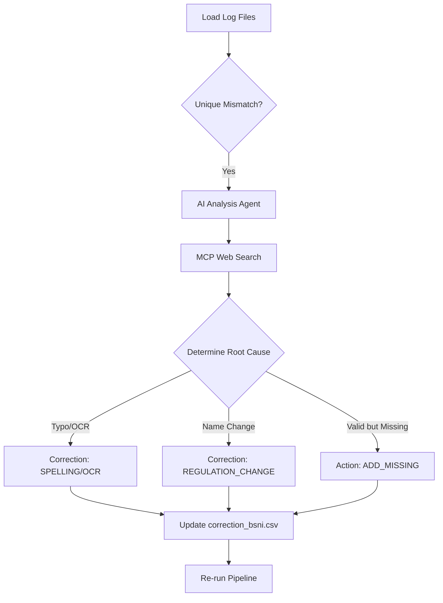

# Logic: BSNI Mismatch Processing with AI

## Overview
This document outlines the logic for resolving discrepancies between administrative data extracted from PDF documents and the BSNI (Badan Standardisasi Nasional Indonesia) reference data using AI with the Model Context Protocol (MCP).

## The Problem
Data alignment between PDF extraction (Index Tables) and BSNI reference (OCR from Kode Wilayah) encounters four types of mismatches, logged in specific files:

| Log File | Mismatch Type | Context |
|----------|---------------|---------|
| `p_bsni_mismatch_pdf.log` | **PDF → BSNI** | PDF has a province name not found in BSNI reference |
| `p_bsni_mismatch_ocr.log` | **BSNI → PDF** | BSNI has a province not found in PDF extraction |
| `k_bsni_mismatch_pdf.log` | **PDF → BSNI** | PDF has a city/capital name not found in BSNI reference |
| `k_bsni_mismatch_ocr.log` | **BSNI → PDF** | BSNI has a city code/name not used by any PDF entry |

These mismatches arise from:
1.  **OCR Errors**: `ldi Rayeuk` vs `Idi Rayeuk` (l vs I)
2.  **Spelling Variations**: `Berabai` vs `Barabai`
3.  **Regulation Changes**: Old name in one source vs new official name (e.g., `Tabanan` vs `Singasana`)
4.  **Scope Differences**: Valid city code in BSNI that is simply not present in the current PDF batch

## The Solution: MCP-Powered AI Analysis

To resolve these without manual verification, we employ an AI Agent using MCP (Model Context Protocol) to perform live web research.

### Logic Flow

### Detailed AI Reasoning Process

For each mismatch pair `(PDF_Value, BSNI_Value)` or single orphan entry:

1.  **Search Phase**:
    - The Agent calls `exa.search` with queries like:
        - *"Official capital city of [Kabupaten X]"*
        - *"[City A] vs [City B] correct spelling"*
        - *"Perubahan nama ibukota [Kabupaten X] regulations"*

2.  **Analysis Phase**:
    - **Spelling/OCR Detection**:
        - If the official name closely matches one value but differs by common OCR mistakes (I/l, O/0, rn/m), categorize as **OCR_ERROR**.
    - **Regulation Detection**:
        - If search results mention a government regulation (UU, PP, Perda) changing the name (e.g., UU No. 79/2024 changing Tabanan to Singasana), categorize as **REGULATION_CHANGE**.
    - **Source Authority**:
        - Prioritize government sources (BPS, official district websites) over generic wikis.

3.  **Correction Generation**:
    - The Agent outputs a structured correction entry:
        - `source_value`: The incorrect/old value
        - `corrected_value`: The verified official value
        - `reason_code`: The category (OCR, SPELLING, REGULATION)
        - `notes`: Citation of the source (e.g., "UU Name Change 2024")

## Integration Strategy

This logic is implemented in a script `src/scripts/llm_bsni_correction.py` which:
1.  Reads the 4 log files.
2.  Iterates through mismatches.
3.  Uses `LLMClient(mcp=True)` to execute the search and reasoning.
4.  Appends verified corrections to `src/datas/correction_bsni.csv`.
5.  Updates the `comparing_bsni.md` documentation with new findings.

This approach transforms error resolution from a manual research task into an automated, evidence-based pipeline step.
