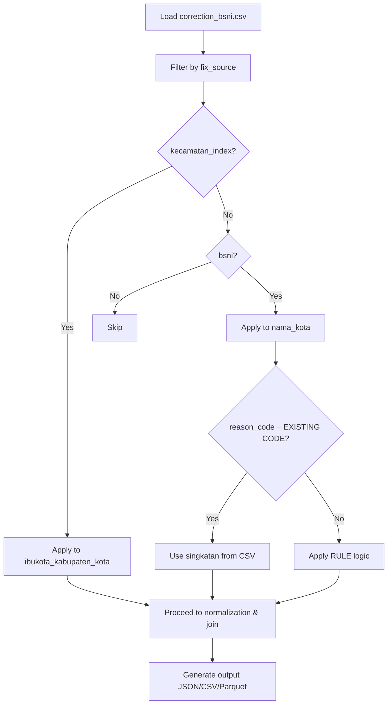

# Kecamatan Index Comparison and Corrections

## Introduction
This document tracks unmatched city names from kecamatan index processing against BSNI kode_wilayah data, documents applied corrections, and outlines the planned BSNICorrection integration to automate fixes. The goal is to improve data accuracy by resolving OCR errors, spelling issues, and regulatory name changes.

## Table of Contents
- [Unmatched City Names](#unmatched-city-names)
- [Corrected Ibukota Names](#corrected-ibukota-names)
- [BSNICorrection Integration](#bsnicorrection-integration)

## Unmatched City Names
**Status**: ✅ **All resolved!** (0 unmatched entries as of 2025-11-20)

### Log Files

Mismatch logs are generated with prefixes by level:

| Log File | Description | Format |
|----------|-------------|--------|
| `p_bsni_mismatch_pdf.log` | Provinces from PDF not in BSNI | `province` |
| `p_bsni_mismatch_ocr.log` | BSNI provinces not in PDF | `province \| singkatan` |
| `k_bsni_mismatch_pdf.log` | Cities from PDF not in BSNI | `city \| kabupaten_kota \| province \| -` |
| `k_bsni_mismatch_ocr.log` | BSNI cities not in PDF | `city \| kabupaten_kota \| province \| singkatan` |

> [!NOTE]
> `p_` = province level, `k_` = kabupaten/kota level

### Previously Unmatched (Now Resolved)

37 entries were previously unmatched from batch processing. All have been resolved through corrections in `correction_bsni.csv`.

| No. | Unmatched City Name | Kabupaten Kota |
| --- | --- | --- |
| 1 | Baolan | Kabupaten Toli-Toli |
| 2 | Berabai | Kabupaten Hulu Sungai Tengah |
| 3 | Bireun | Kabupaten Bireuen |
| 4 | Boroko | Kabupaten Bolaang Mongondow Utara |
| 5 | Grogol Petamburan | Kota Administrasi Jakarta Barat |
| 6 | Idi Rayeuk | Kabupaten Aceh Timur |
| 7 | Ilaga | Kabupaten Puncak |
| 8 | Kafemananu | Kabupaten Timor Tengah Utara |
| 9 | Kota Tidore Kepulauan | Kota Tidore Kepulauan |
| 10 | Kototangah | Kota Padang |
| 11 | Malaka Tengah | Kabupaten Malaka |
| 12 | Melongguane | Kabupaten Kepulauan Talaud |
| 13 | Mentok | Kabupaten Bangka Barat |
| 14 | Morotai Selatan | Kabupaten Pulau Morotai |
| 15 | Padangsidimpuan | Kota Padang Sidempuan |
| 16 | Padang Sidempuan | Kabupaten Tapanuli Selatan |
| 17 | Pangkajene Sidenreng | Kabupaten Pangkajene dan Kepulauan |
| 18 | Parik Malintang | Kabupaten Padang Pariaman |
| 19 | Pasir Pengarairan | Kabupaten Rokan Hulu |
| 20 | Pelabuhan Ratu | Kabupaten Sukabumi |
| 21 | Pelembang | Kota Palembang |
| 22 | Pulau Seribu | Kabupaten Administrasi Kepulauan Seribu |
| 23 | Sanggatta | Kabupaten Kutai Timur |
| 24 | Singasana | Kabupaten Tabanan |
| 25 | Sukadane | Kabupaten Kayong Utara |
| 26 | Sunggu Minahasa | Kabupaten Gowa |
| 27 | Taliabu Barat | Kabupaten Pulau Taliabu |
| 28 | Wangi Wangi | Kabupaten Wakatobi |
| 29 | Aimas | Kabupaten Sorong |
| 30 | Gerung | Kabupaten Lombok Barat |
| 31 | Limboto | Kabupaten Gorontalo |
| 32 | Muara Beliti | Kabupaten Musi Rawas |
| 33 | Mojosari | Kabupaten Mojokerto |
| 34 | Oelamasi | Kabupaten Kupang |
| 35 | Pare | Kabupaten Kediri |
| 36 | Pandan | Kabupaten Tapanuli Tengah |
| 37 | Sentani | Kabupaten Jayapura |

## Corrected Ibukota Names
These corrections are documented in [`src/utils/correction_bsni.csv`](src/utils/correction_bsni.csv) and address the unmatched entries above. **Summary: 11 BSNI fixes, 28 kecamatan_index fixes (39 total corrections)**. The BSNI abbreviations guide document is available at [`src/datas/guide_bsni/SNI_7657_2023_40_251116_052053.md`](src/datas/guide_bsni/SNI_7657_2023_40_251116_052053.md).

| No. | City Name | singkatan_nama_kota | reason_k_bsni | Kabupaten Kota | Province | Fix Location | Notes |
--- | --- | --- | --- | --- | --- | --- | --- |
| 1 | Idi Rayeuk | IRY | EXISTING CODE | Kabupaten Aceh Timur | Aceh | bsni | OCR error: "ldi Rayeuk" (l instead of I) |
| 2 | Singasana | SGS | RULE 7: S + G + S (4 syllables) | Kabupaten Tabanan | Bali | bsni | Wrong city name: "Tabanan" should be "Singasana" (UU 79/2024) |
| 3 | Mentok | MTK | EXISTING CODE | Kabupaten Bangka Barat | Kepulauan Bangka Belitung | bsni | Spelling error: "Muntok" should be "Mentok" |
| 4 | Ilaga | ILG | EXISTING CODE | Kabupaten Puncak | Papua Tengah | bsni | OCR error: "llaga" (l instead of I) |
| 5 | Pangkajene Sidenreng | PKR | RULE 3: P + K + R (3 words) | Kabupaten Sidenreng Rappang | Sulawesi Selatan | bsni | Wrong city name: "Sidenreng" should be "Pangkajene Sidenreng" (UU 143/2024) |
| 6 | Baolan | BOL | RULE 5: B + O + L (2 syllables) | Kabupaten Toli-Toli | Sulawesi Tengah | bsni | Wrong city name: "Toli Toli" should be "Baolan" |
| 7 | Boroko | BRK | EXISTING CODE | Kabupaten Bolaang Mongondow Utara | Sulawesi Utara | bsni | Spelling error: "Baroko" should be "Boroko" |
| 8 | Parik Malintang | PMT | RULE 4: P + M + T (2 words) | Kabupaten Padang Pariaman | Sumatra Barat | bsni | Wrong city name: "Nagari Parit Malintang" should be "Parik Malintang" (UU 47/2024) |
| 9 | Padangsidimpuan | PSP | EXISTING CODE | Kota Padangsidimpuan | Sumatra Utara | bsni | Wrong city name: "Padang Sidempuan" should be "Padangsidimpuan" (UU 8/2023) |
| 10 | Sipirok | SPR | EXISTING CODE | Kabupaten Tapanuli Selatan | Sumatra Utara | kecamatan_index | Wrong city name: "Padang Sidempuan" should be "Sipirok" |
| 11 | Koto Tangah | KTT | RULE 4: K + T + T (2 words) | Kota Padang | Sumatra Barat | bsni, kecamatan_index | Wrong city name: BSNI shows "Padang", kecamatan_index shows "Kototangah" (typo), should be "Koto Tangah" |
| 12 | Bireuen | BRE | EXISTING CODE | Kabupaten Bireuen | Aceh | kecamatan_index | Spelling error: "Bireun" should be "Bireuen" |
| 13 | Kembangan | KBN | EXISTING CODE | Kota Administrasi Jakarta Barat | Daerah Khusus Ibukota Jakarta | kecamatan_index | Wrong city name: "Grogol Petamburan" should be "Kembangan" |
| 14 | Pulau Pramuka | PPR | EXISTING CODE | Kabupaten Administrasi Kepulauan Seribu | Daerah Khusus Ibukota Jakarta | kecamatan_index | Wrong city name: "Pulau Seribu" should be "Pulau Pramuka" |
| 15 | Palabuhanratu | PRT | EXISTING CODE | Kabupaten Sukabumi | Jawa Barat | kecamatan_index | Spelling error: "Pelabuhan Ratu" should be "Palabuhanratu" |
| 16 | Sukadana | SDN | EXISTING CODE | Kabupaten Kayong Utara | Kalimantan Barat | kecamatan_index | Spelling error: "Sukadane" should be "Sukadana" |
| 17 | Barabai | BRB | EXISTING CODE | Kabupaten Hulu Sungai Tengah | Kalimantan Selatan | kecamatan_index | Spelling error: "Berabai" should be "Barabai" |
| 18 | Sangatta | SGT | EXISTING CODE | Kabupaten Kutai Timur | Kalimantan Timur | kecamatan_index | Spelling error: "Sanggatta" should be "Sangatta" |
| 19 | Tidore | TDR | EXISTING CODE | Kota Tidore Kepulauan | Maluku Utara | kecamatan_index | Wrong city name: "Kota Tidore Kepulauan" should be "Tidore" |
| 20 | Daruba | DRB | EXISTING CODE | Kabupaten Pulau Morotai | Maluku Utara | kecamatan_index | Wrong city name: "Morotai Selatan" should be "Daruba" |
| 21 | Bobong | BBG | EXISTING CODE | Kabupaten Pulau Taliabu | Maluku Utara | kecamatan_index | Wrong city name: "Taliabu Barat" should be "Bobong" |
| 22 | Kefamenanu | KFM | EXISTING CODE | Kabupaten Timor Tengah Utara | Nusa Tenggara Timur | kecamatan_index | Spelling error: "Kafemananu" should be "Kefamenanu" |
| 23 | Betun | BET | EXISTING CODE | Kabupaten Malaka | Nusa Tenggara Timur | kecamatan_index | Wrong city name: "Malaka Tengah" should be "Betun" |
| 24 | Pasir Pengaraian | PRP | EXISTING CODE | Kabupaten Rokan Hulu | Riau | kecamatan_index | Spelling error: "Pasir Pengarairan" should be "Pasir Pengaraian" |
| 25 | Sungguminasa | SGM | EXISTING CODE | Kabupaten Gowa | Sulawesi Selatan | kecamatan_index | Spelling error: "Sunggu Minahasa" should be "Sungguminasa" |
| 26 | Wangi-Wangi | WGI | EXISTING CODE | Kabupaten Wakatobi | Sulawesi Tenggara | kecamatan_index | Spelling error: "Wangi Wangi" should be "Wangi-Wangi" |
| 27 | Melonguane | MGN | EXISTING CODE | Kabupaten Kepulauan Talaud | Sulawesi Utara | kecamatan_index | Spelling error: "Melongguane" should be "Melonguane" |
| 28 | Palembang | PLG | EXISTING CODE | Kota Palembang | Sumatra Selatan | kecamatan_index | Spelling error: "Pelembang" should be "Palembang" |
| 29 | Aimas | AMS | EXISTING CODE | Kabupaten Sorong | Papua Barat Daya | kecamatan_index | Wrong city name: "Sorong" should be "Aimas" |
| 30 | Gerung | GRG | EXISTING CODE | Kabupaten Lombok Barat | Nusa Tenggara Barat | kecamatan_index | Wrong city name: "Mataram" should be "Gerung" |
| 31 | Limboto | LBT | EXISTING CODE | Kabupaten Gorontalo | Gorontalo | kecamatan_index | Wrong city name: "Gorontalo" should be "Limboto" |
| 32 | Muarabeliti | MBL | EXISTING CODE | Kabupaten Musi Rawas | Sumatra Selatan | kecamatan_index | Wrong city name: "Lubuk Linggau" should be "Muarabeliti" |
| 33 | Mojosari | MJS | EXISTING CODE | Kabupaten Mojokerto | Jawa Timur | kecamatan_index | Wrong city name: "Mojokerto" should be "Mojosari" |
| 34 | Oelamasi | OLM | EXISTING CODE | Kabupaten Kupang | Nusa Tenggara Timur | kecamatan_index | Wrong city name: "Kupang" should be "Oelamasi" |
| 35 | Pamenang | PMG | RULE 6: P + M + G (3 syllables) | Kabupaten Kediri | Jawa Timur | bsni, kecamatan_index | Wrong city name: BSNI shows "Pare", kecamatan_index shows "Kediri" should be "Pamenang" |
| 36 | Pandan | PDN | EXISTING CODE | Kabupaten Tapanuli Tengah | Sumatra Utara | kecamatan_index | Wrong city name: "Sibolga" should be "Pandan" |
| 37 | Sentani | STN | EXISTING CODE | Kabupaten Jayapura | Papua | kecamatan_index | Wrong city name: "Jayapura" should be "Sentani" |

# BSNICorrection Integration

## Overview
The `BSNICorrection` class in `src/pipeline/corrections/bsni.py` will load and apply corrections from `src/datas/correction_bsni.csv` to improve matching accuracy in the kecamatan and kode_wilayah pipelines. This implements a "Both Sides Application" approach, correcting data on both the extracted kecamatan side and the reference kode_wilayah side.

## Correction Application Flow

## Kecamatan_Index Side
- **Integration Point**: `PDFTableExtractor.kecamatan_index()` in [`src/extractor/pdf_table_extractor.py`](src/extractor/pdf_table_extractor.py) (lines 620-643)
- **Corrections Applied**: 
  - Filter `fix_source='kecamatan_index'`
  - Apply `source_value → corrected_value` to `ibukota_kabupaten_kota`
  - **Context-aware**: Matches `kabupaten_kota` from metadata to ensure location-specific accuracy
  - Updates final dataframe with corrected `ibukota_kabupaten_kota` values
- **Impact**: Resolved 28 unmatched entries by addressing OCR/spelling errors
- **Key Files**: [`src/extractor/pdf_table_extractor.py`](src/extractor/pdf_table_extractor.py), [`src/datas/correction_bsni.csv`](src/datas/correction_bsni.csv)

## Kode_Wilayah Side
- **Integration Point**: `KodeWilayahOCR._process_table_text()` in [`src/extractor/kode_wilayah_ocr.py`](src/extractor/kode_wilayah_ocr.py) (lines 145-177)
- **Corrections Applied**: 
  - Filter `fix_source='bsni'`
  - Apply `source_value → corrected_value` to `nama_kota`
  - Update `singkatan_nama_kota` from `singkatan` column in metadata
  - **NEW**: Update `kabupaten_kota` from metadata when specified (lines 163-165)
- **Logic**: Uses metadata to update both city name and regency name for consistency
- **Impact**: Corrected 11 OCR errors and applied regulatory updates (e.g., UU changes)
- **Key Files**: [`src/extractor/kode_wilayah_ocr.py`](src/extractor/kode_wilayah_ocr.py), [`src/datas/correction_bsni.csv`](src/datas/correction_bsni.csv)

## Implementation Notes
- CSV structure works well for current dataset (39 corrections); `entity_level` column retained for future extensibility
- Tested with all 38 provinces - **100% success rate, 0 unmatched entries**
- Composite join key (`kabupaten_kota` + `ibukota_kabupaten_kota`) ensures accurate matching

