# Lampiran B (informatif) Petunjuk penyingkatan

1. Nama kota yang terdiri atas tiga huruf,tidak disingkat.

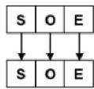

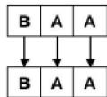

2. Singkatan Nama kota terdiri atas tiga huruf dari A hingga Z yang merepresentasikan Nama kota, ditulis dalam huruf kapital.

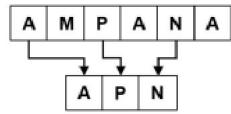

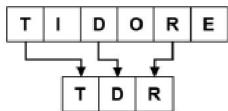

3. Nama kota yang terdiri atas tiga kata, singkatan Nama kota menggunakan huruf awal dari tiap kata.

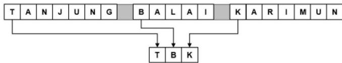

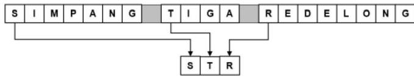

4. Nama kota yang terdiri atas dua kata, singkatan Nama kota menggunakan huruf awal dari kedua kata ditambahkan atau disisipkan satu huruf konsonan dari suku kata kedua pada kata pertama atau pada kata kedua.

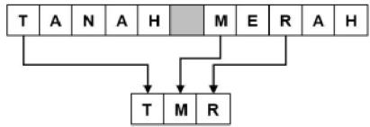

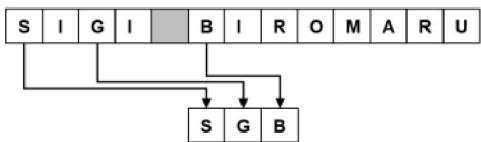

5. Nama kota yang terdiri atas tahun, singkatan Nama kota menggunakan huruf awal kata ditambah dua huruf, diutamakan huruf konsonan suku kata kedua atau huruf terakhir Nama kota.

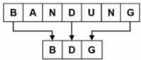

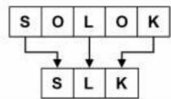

6. Nama kota yang terdiri atas kepada tiga suku kata, singkatan Nama kota menggunakan huruf awal kata ditambah dua huruf. Pemilihan dua huruf tersebut diutamakan huruf awal pembentuk siku kata kedua diikuti huruf pertama siku kata terakhir atau huruf terakhir dari Nama kota.

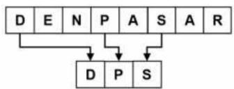

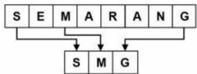

7. Nama kota yang terdiri atas satu kata tahun dengan empat suku kata, singkatan Nama kota menggunakan huruf awal kata ditambah dua huruf. Dua huruf tersebut dapat dipilih dari huruf pertama suku kata kedua, diikuti oleh huruf awal suku kata ketiga atau keempat atau huruf terakhir dari Nama kota tersebut.

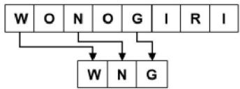

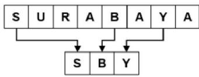

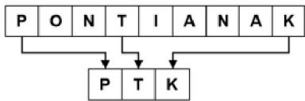

8. Nama kota yang terdiri atas satu kata dengan lima suku kata, maka singkatan Nama kota menggunakan huruf awal kata ditambah dua huruf. Dua huruf tersebut diutamakan huruf pertama dari suku kata kedua, diikuti oleh huruf pertama suku kata ketiga, keempat, atau kelima dari Nama kota tersebut.

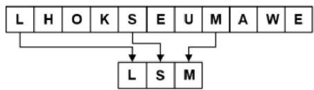

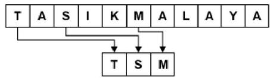

9. Nama kota yang berbentuk pengulangan dari kata pertama, yang disingkat adalah kata yang membentuk pola pengulangannya dan memakai prinsip penyingkatannya mengacu pola 1 sampai dengan 9 pada Pasal 4.1.

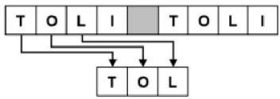

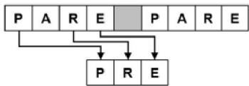

10. Penyingkatan mempertimbangkan kemudahan dalam pelafalan serta mempertimbangkan penggunaannya di masyarakat.

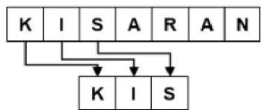

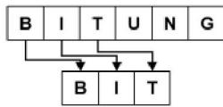

11. Singkatan Nama Kota pada tingkatan ibu kota tidak boleh sama.

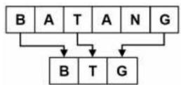

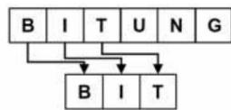

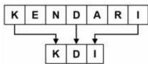

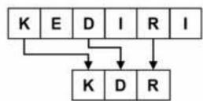